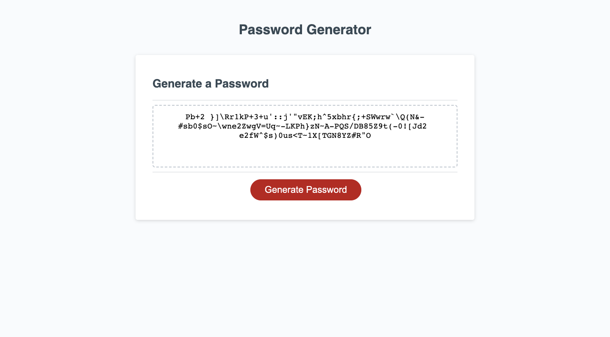

# Generate pass easy
## Description

Link to deployed application
 https://itcreativeusa.github.io/Generate-pass-easy

Github link 
https://github.com/itcreativeusa/Generate-pass-easy

This Generate pass easy application was created as a bootcamp everyweek student challege. This website is a HTML, CSS, JS random password generator page. 

## Table of Contents (Optional)

- [Installation](#installation)
- [Usage](#usage)
- [Requirements](#requirements)
- [Credits](#credits)
- [License](#license)

## Installation

N/A

## Requirements

No special requirements

## Usage

Screenshot located in a root folder

   

## Credits

## License

Please refer to the LICENSE in the repo.

