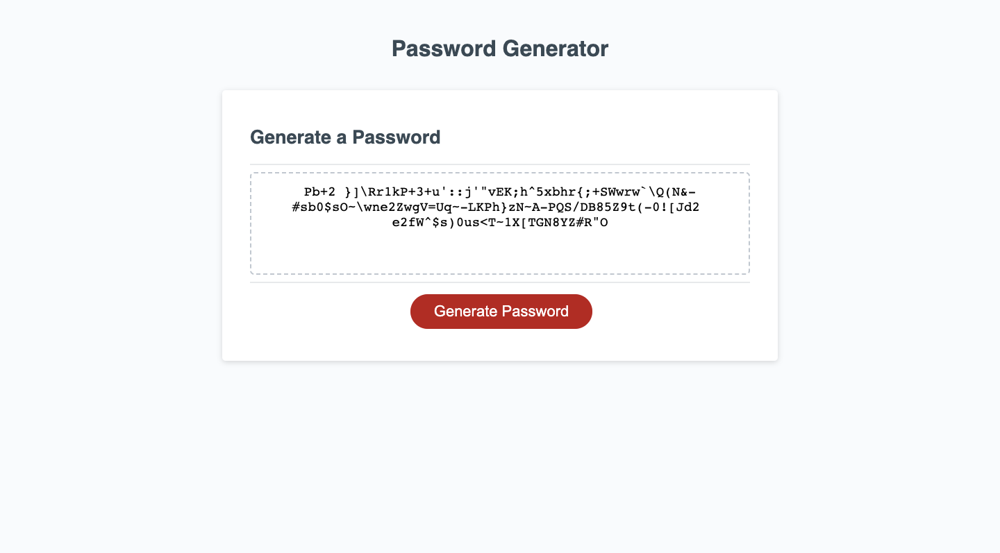

# Generate pass easy
## Description

Link to deployed application
 https://itcreativeusa.github.io/generate-pass-easy

Github link 
https://github.com/itcreativeusa/generate-pass-easy

This application is a Javascript random password generator. It was created as a bootcamp everyweek student challege.
Password generaor is easy to use. User need to press the "Generete password" button and follow application instuctions by answering each prompt. The length of password from is 8 up to 128 characters. At least one character type should be selected. Password could be generated with lowercase, uppercase, numeric, and/or special characters.
 
## Table of Contents (Optional)

- [Installation](#installation)
- [Usage](#usage)
- [Requirements](#requirements)
- [Credits](#credits)
- [License](#license)

## Installation

N/A

## Requirements

No special requirements

## Usage

To run application press the "Generete password" button and answer each prompt. Then application will generate random password including selected by user lowercase, uppercase, numeric, and/or special characters.

Screenshot located in ``` assets/images ``` folder


   

## Credits
90% of code including : index.html, style.css, script.js provided by Berkeley Bootcamp for studying purposes. My code was added to existing script.js.  

## License

Please refer to the LICENSE in the repo.


